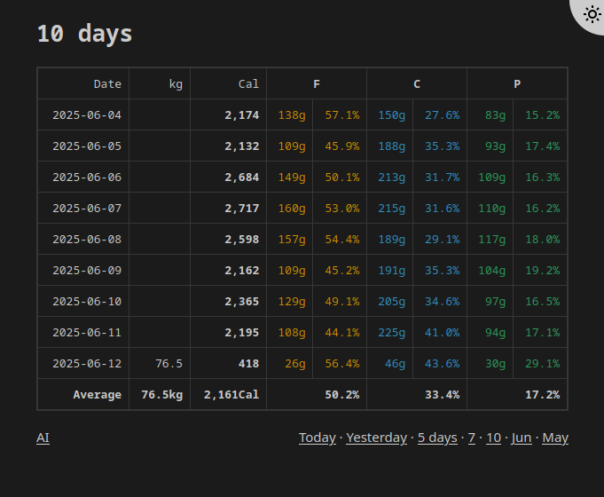

# cal-calc

A voice-controlled hybrid app for tracking and storing calorie intake. It uses ChatGPT or DeepSeek to estimate the caloric content of the food you eat and generates a link to add the record to a database.

## Screenshot



## Why?

AI agents, such as ChatGPT, are excellent tools for counting calories. They know the caloric content of various foods and are familiar with most commercial products. However, they can only store data temporarily - as the amount of information grows, the agent begins to forget earlier records. It's often unclear what remains within their memory scope and what has been forgotten.

## How to use

*Works with voice commands to ChatGPT | DeepSeek:*

**You (speaking to your phone)**: Add 150gr cooked pasta and 50gr fried pork chops.

**ChatGPT** | **DeepSeek**: [Here is your clickable link](#link-goes-here) with 150g cooked pasta and 50g fried pork chops:


📊 Nutrition Facts:

    * 150g Cooked Pasta (plain):
        * Calories: 195 kcal
        * Fat: 1g
        * Carbs: 40g
        * Protein: 7g

    * 50g Fried Pork Chop:
        * Calories: 125 kcal
        * Fat: 8g
        * Carbs: 0g
        * Protein: 12g

---

The actual link should be:
```
https://BASE-URL.COM/?accesskey=ACCESSKEY&food[cooked_pasta]=195,150,1,40,7&food[pork_chop]=125,50,8,0,12
```
where obviously *BASE-URL.COM* is the URL of the app and ACCESSKEY is your accesskey from `config.php`

## Requirements

* Any PHP enabled host with PHP and SQLite3 extension
* A working URL address to the app

## How to install

* Upload, rename the folder DATABASE and make it writeable (CHMOD to 777)
* Make DATABASE/db.sqlite writeable (CHMOD to 666)
* Replace the default accesskey *12345678* with your own key in `config.php`
* Send the **AI Prompt** to ChatGPT or DeepSeek (see below)

## AI Prompt

[The required AI prompt](prompt_en.html) - you can translate it to another language

- Do not forget to replace **BASE-URL.COM** with the actual URL beforehand
- Do not forget to replace **12345678** with your accesskey beforehand

## Misc

* To view stored data: **BASE-URL.COM/view.php**
* Both ChatGPT and DeepSeek refuse to open links by themselves - that's why you have to click on the generated link

## License

MIT
